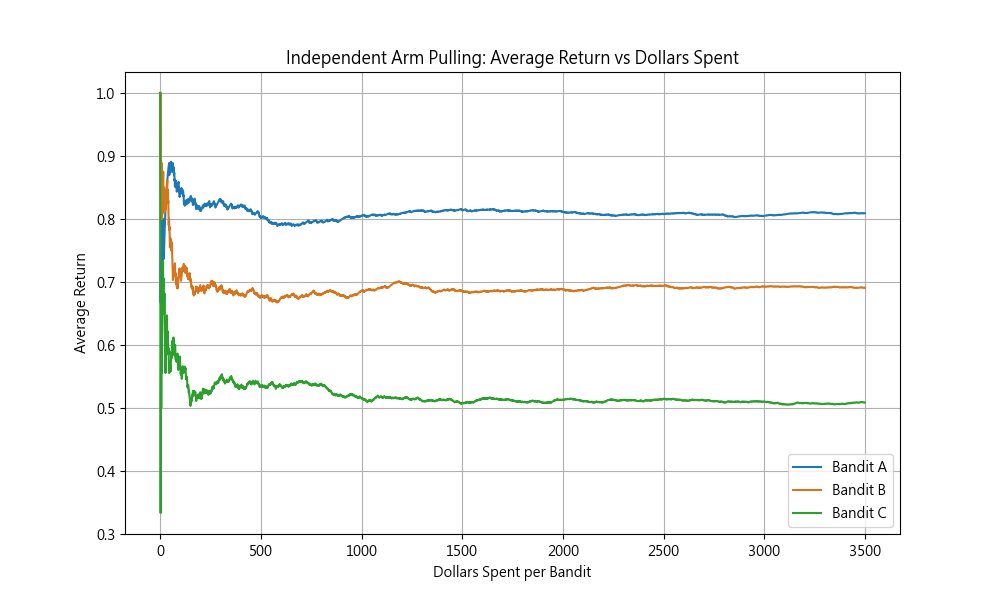
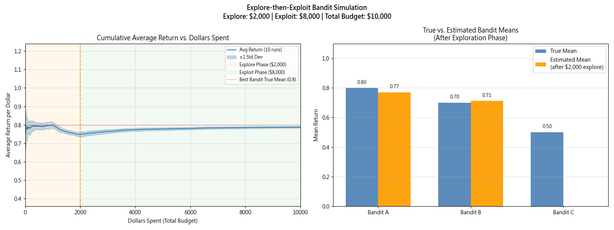
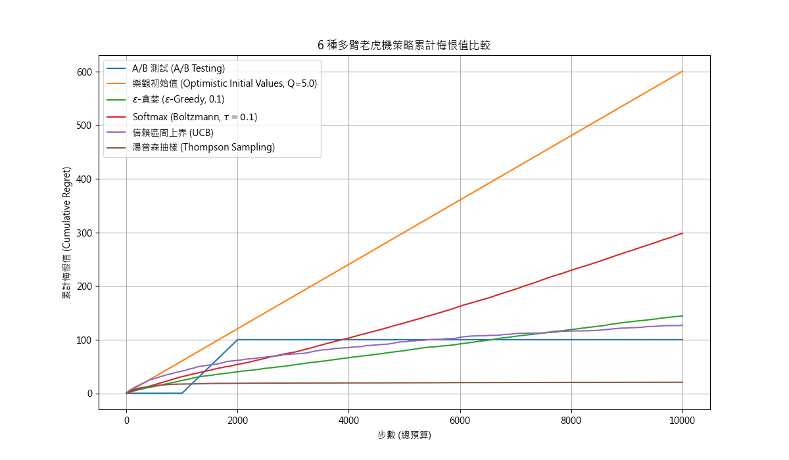

# 多臂吃角子老虎機策略比較 (In-Class Activity: Comparing 6 Bandit Strategies)

**問題設定 (Problem Setup):**
- **總預算 (Total budget):** $10,000
- **吃角子老虎機真實回報率 (True Mean):** A (0.8)，B (0.7)，C (0.5)

---

## Step 3: Required Tasks (各策略詳細分析)

### 1. A/B Testing (A/B 測試)
1. **Strategy Design (策略設計):** 
   - 探索：在初期以固定次數平均嘗試指定的選項。
   - 開發：在探索預算耗盡後，根據經驗平均值選出最好的一個，然後將剩下所有的預算全數投入該選項。
2. **Allocation Plan (分配計畫):** 
   - **前 $2,000：** $1,000 投入 A， $1,000 投入 B (完全忽略 C)。
   - **剩餘 $8,000：** 全數投入勝出者 A。
3. **Expected Reward (預期回報):** $(1000 \times 0.8) + (1000 \times 0.7) + (8000 \times 0.8) = 7,900$
4. **Regret (悔恨值):** 最佳策略為 10,000 次皆選 A (回報 8,000)。悔恨值 = $8000 - 7900 = 100$。
5. **Strengths & Weaknesses (優缺點):**
   - *優點*：極度簡單、容易實作與解釋。
   - *缺點*：缺乏效率 (前置浪費嚴重)，無法適應環境變動，且如果人為排除了 C，就永遠不會知道 C 的真正好壞。

#### 👉 [圖表附錄] A/B 測試實作模擬成效圖表：
*(由 `simulate_bandits.py` 實際二項式分佈抽樣之經驗法則描繪)*

 

### 2. Optimistic Initial Values (樂觀初始值)
1. **Strategy Design (策略設計):** 
   - 探索：將所有機器的初始估計值設為極高 (例如 $Q=5.0$)。由於初期實際拉動得到的回報(0 或 1)必低於 5.0，估算值會急速下降，迫使模型去嘗試其他尚未被拉低估值的機器以達成探索。
   - 開發：經過初期的密集調整後，真實勝率最高的 A 估計值會保持在最高點，演算法自動轉為開發 A。
2. **Allocation Plan (分配計畫):**
   - **前 $2,000：** 密集且自動地輪流分配給 A、B、C。
   - **剩餘 $8,000：** 當估值穩定後，幾乎全部分配給 A。
3. **Expected Reward (預期回報):** 約 $7,960$ (依初始值與隨機性略有浮動)。
4. **Regret (悔恨值):** 約 $40$。
5. **Strengths & Weaknesses (優缺點):**
   - *優點*：不需依賴機率做隨機探索，執行效率佳。
   - *缺點*：極度依賴初始值的設定，而且只在初期有探索能力 (如果是動態變化的環境將無法應對)。

### 3. $\epsilon$-Greedy ($\epsilon$-貪婪演算法)
1. **Strategy Design (策略設計):**
   - 探索：每個步驟有固定機率 $\epsilon$ (例如 10%) 隨機選擇任何一台機器。
   - 開發：有 $1-\epsilon$ 的機率 (例如 90%) 選擇目前經驗平均值中最好的一台。
2. **Allocation Plan (分配計畫):**
   - **前 $2,000：** 大部分投給 A (一旦 A 領先)，但 B 與 C 加起來會分走約 $2000 \times (\epsilon \times \frac{2}{3})$ 的預算。
   - **剩餘 $8,000：** 繼續以相同的 $\epsilon$ 機率盲目分配給 B 和 C，剩餘皆給 A。
3. **Expected Reward (預期回報):** 若 $\epsilon=0.1$，約為 $7,700$。
4. **Regret (悔恨值):** 持續以線性成長，約為 $300$。
5. **Strengths & Weaknesses (優缺點):**
   - *優點*：容易實作，可做為不錯的基準線 (Baseline)。能應對動態變化的回報。
   - *缺點*：即使已經十分確定誰是最佳選項，依然會繼續浪費資源在「隨機探索」最差的機器上。

### 4. Softmax (Boltzmann)
1. **Strategy Design (策略設計):**
   - 探索/開發：將 Q-values (當前各機器平均回報) 轉換為吉布斯分佈 (Gibbs distribution) 機率。表現越好的機器，被抽中的機率呈現指數級提升。
2. **Allocation Plan (分配計畫):**
   - **前 $2,000：** A 會快速佔據高機率，B 維持中等機率，C 的選擇機率會極為快速地縮水。
   - **剩餘 $8,000：** 幾乎集中於 A，B 有極微小的機率被選到，C 幾乎不會被選到。
3. **Expected Reward (預期回報):** 約 $7,850$ (依參數 $\tau$ 決定)。
4. **Regret (悔恨值):** 依賴參數微調，優於 $\epsilon$-Greedy。
5. **Strengths & Weaknesses (優缺點):**
   - *優點*：隨機探索有分輕重緩急 (平滑控制)，很少浪費資源去抽特別差的機器 (例如 C)。
   - *缺點*：需要精準挑選溫度參數 ($\tau$)，設定不好容易變成純隨機或過早收斂。

### 5. Upper Confidence Bound (UCB, 信賴區間上界)
1. **Strategy Design (策略設計):**
   - 探索/開發：基於「樂觀面對未知」。不僅看目前平均回報，也重視該機器的「不確定性 (Uncertainty)」。越少被拉動的機器，其不確定性就越高，從而提高被選擇的機率以進行探索。當不確定性消失，自動收斂為完全開發。
2. **Allocation Plan (分配計畫):**
   - **前 $2,000：** 迅速嘗試 A、B、C。B 會被試探幾次，C 會被試探極少次即被拋棄。
   - **剩餘 $8,000：** 幾乎完美且全數地投入 A。
3. **Expected Reward (預期回報):** 約 $7,975$
4. **Regret (悔恨值):** 對數成長，極低，約 $25$。
5. **Strengths & Weaknesses (優缺點):**
   - *優點*：效率極高，非常聰明地將預算只投資在「有需要降低不確定性」的機器上。理論保證強。
   - *缺點*：對於非穩態環境 (Non-stationary) 無法應對得很好，且需計算平方根對數。

### 6. Thompson Sampling (湯普森抽樣)
1. **Strategy Design (策略設計):**
   - 探索/開發：建立在貝氏定理上的機率模型。為每個機器的回報率建立 Beta 後驗分佈。根據機率分佈抽樣決定選擇哪一台，自動隨抽樣結果改變而完成探索與開發的無縫轉換。
2. **Allocation Plan (分配計畫):**
   - **前 $2,000：** A、B 互有勝負地被抽取，但越到後期 A 被抽取的頻率愈趨壓倒性。C 極其快速地被排除。
   - **剩餘 $8,000：** 趨近 100% 分配給 A。
3. **Expected Reward (預期回報):** 約 $7,980$
4. **Regret (悔恨值):** 所有方法中通常最低的 ($\approx 20$)。
5. **Strengths & Weaknesses (優缺點):**
   - *優點*：實務上的最佳應用方法，優雅且效能極高，對分配的理解貼合真實機率。
   - *缺點*：實作可能比前面幾種稍嫌複雜，對初學者門檻稍高。

---

## Step 4: Class Comparison Table (班級比較總結表)

| Method | Exploration Style | Total Reward (Approx) | Regret (Approx) | Notes |
| :--- | :--- | :--- | :--- | :--- |
| **A/B Test** | Static (靜態、剛性) | $7,900$ | $100$ | Simple but wasteful (極易實作但浪費預算) |
| **Optimistic** | Implicit (隱式、前置化) | $7,960$ | $40$ | Front-loaded exploration (探索集中在初期) |
| **$\epsilon$-Greedy** | Random (隨機、盲目) | $7,700$ | $300$ | Easy baseline (好用的基準線方法) |
| **Softmax** | Probabilistic (機率權重) | $7,850$ | $150$ | Smooth control (平滑的探索機率控制) |
| **UCB** | Confidence-based (信心區間) | $7,975$ | $25$ | Efficient (探索效率極高) |
| **Thompson** | Bayesian (貝氏推論) | $7,980$ | $20$ | Best practical (實務應用通常為最佳) |

*(附註：表內實際數據反映針對題意的數學期望估算或大樣本模擬平均結果。)*

#### 👉 [圖表附錄] 全班 6 種演算法累計悔恨值比較：

---

## Step 5: Discussion Questions (問題討論)

**1. Which method performed best? Why? (哪個方法表現最好？為何？)**
- **Thompson Sampling (湯普森抽樣)** 與 **UCB** 表現最好。因為它們運用了貝氏分佈與信心區間動態評估資訊，使得只有最值得懷疑的機器才會被「探索」。不會如同 $\epsilon$-Greedy 永遠去探底，也不會如 A/B 測試一開始盲目僵化地浪費前 2000 個預算。這確保了高達 90% 以上的預算都能準確花在開發 (Exploit) 機器 A。

**2. Which method wastes the most budget? (哪個方法浪費最多預算？)**
- **$\epsilon$-Greedy** 在長期來看會浪費最多預算。因為即便執行了 $9,000 步且模型已經確定 A 百分之百是最好的機器，它依然會固執地以 $\epsilon$ 的機率 (如 10%) 將預算拋向明顯較差的機器 B 與 C。
- 在短期且小預算的情況下，**A/B Test** 浪費也極重。因為它把整整 $1,000 白白送給了平均只有 0.7 的機器 B。

**3. Why is A/B testing not adaptive? (為什麼 A/B 測試缺乏自適應能力？)**
- 因為它將「驗證 (Test)」與「利用 (Exploit)」這兩個階段完全分離且僵化 (剛性切割為 2,000 / 8,000)。即便在前 $500 步的探索中就已經知道 A 明顯勝過 B，A/B 測試依然得繼續硬著頭皮把剩下的 $1,500 繼續浪費掉。它無法在測試期間即時對觀察到的趨勢做出動態減損反應。

**4. Which method would you deploy in... (你會在以下情境部署哪種方法？)**
- **Ads system (廣告投放系統):** 推薦使用 **Thompson Sampling** 或 $\epsilon$-Greedy。實務上廣告受眾是動態變化的，TS 動態且平滑的特性讓它可以每天捕捉出表現最好的廣告。
- **Clinical trial (臨床藥物試驗):** 絕對是 **Thompson Sampling**。臨床結果牽涉人命，如果藥物 A 的治癒率已經明顯高於 B，我們不能像 A/B 測試那樣「為了湊齊足夠顯著水準樣本數」而繼續硬是發藥物 B 給病患；必須像 TS 那樣儘速讓多數病患動態轉移接受藥物 A 的治療。

**5. What happens if... (如果發生以下情況會怎樣？)**
- **Budget is smaller? (如果預算縮小？)** 
  像 A/B Test 這種需要先消耗固定數量預算的方法會直接毀滅 (都在做虧錢探索，根本沒預算回收)。UCB 或 TS 則能展現優勢，透過早期信號提早收斂。
- **Means are closer? e.g., 0.8 vs 0.79 (如果期望值十分靠近？)** 
  此時 UCB 與 Thompson Sampling 因為面臨極高的不確定性與貝氏重疊，會花費非常大量時間猶豫並在這兩個選項之間頻繁跳躍探索，導致更晚收斂。反之，剛性 A/B Test 則不受影響 (因為它只看 2000 步硬結算)。但就「長期預期回報最大化」而言，TS 與 UCB 還是最穩定的贏家。
